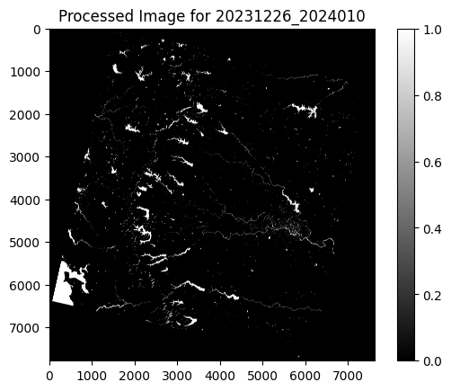
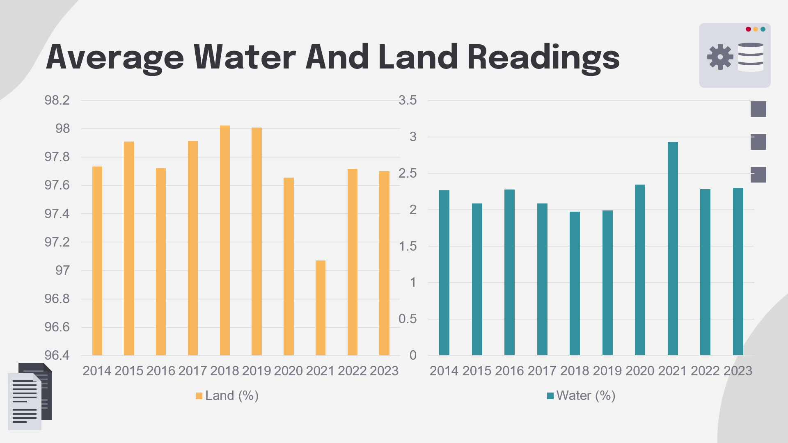
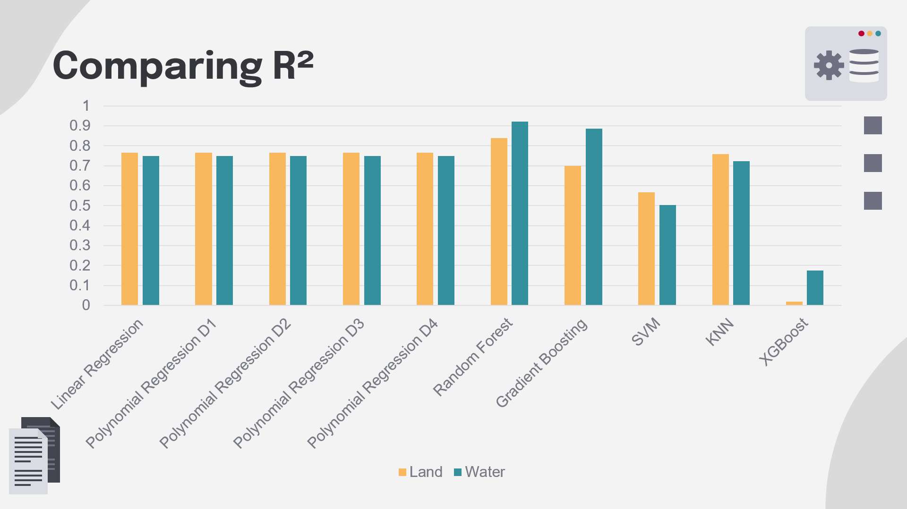
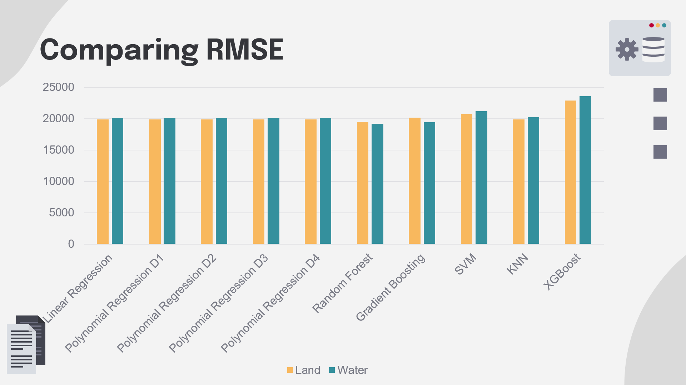

README

# Demographic Location Surface Water Mapping Project

Welcome to the Demographic Location Surface Water Mapping Project repository! This project addresses challenges related to water resource management by mapping surface water bodies using satellite imagery and digital image processing techniques and predicting the future.

## Table of Contents

- [Introduction](#introduction)
- [Objectives](#objectives)
- [Problem Statement](#problem-statement)
- [Dataset Description](#dataset-description)
- [Technology Stack](#technology-stack)
- [Results](#results)
- [Preprocessing Output](#preprocessing-output)
- [Average Water and Land](#Average-Water-and-Land)
- [R^2](#r^2)
- [RMSE](#rmse)

## Introduction

In today’s world, where urban development and the impact of climate change present obstacles to our water resources, the Demographic Location Surface Water Mapping Project emerges as a much-needed initiative. This project aims to address challenges related to water resource management by mapping surface water bodies using satellite imagery and digital image processing techniques. Additionally, it incorporates the task of predicting future land and water patterns, providing valuable insights for sustainable planning and conservation efforts.

## Objectives

The objectives of this project are multi-faceted:

1. **Data Analysis:** Analyze existing datasets and evaluate various image processing techniques employed in similar studies.

2. **Algorithm Development:** Design and develop machine learning algorithms tailored for satellite image classification tasks, as well as predictive modeling for future land and water patterns.

3. **Result Analysis:** Perform comprehensive analysis and comparison of results obtained from different approaches, ensuring accuracy and reliability.

## Problem Statement

One of the primary challenges tackled by this project is the development of an efficient satellite image classification system. This involves utilizing sophisticated image processing techniques and machine learning algorithms to overcome obstacles such as sun and mountain shadows. By implementing shadow correction methods, the goal is to accurately differentiate between land and water areas in satellite imagery, thereby enhancing the interpretation process. Moreover, predicting future land and water patterns adds another layer of complexity, requiring advanced modeling techniques to forecast changes over time accurately.

## Dataset Description

The dataset utilized in this project consists of Landsat 8 Operational Land Imager (OLI) images captured over the Pune District. These images offer a detailed view of the region's topographical and environmental characteristics, providing invaluable insights for geospatial analysis.

**Source:** The dataset was obtained from the US Geological Survey (USGS) Global Visualization Viewer, a reputable repository of satellite imagery.

**Spatial Coverage:**
- **Path:** 147
- **Row:** 047
- **Region:** Pune District

**Temporal Coverage:**
- **Start Date:** January 2023
- **End Date:** December 2023

**Note:** Images from July and August 2022 were excluded due to significant cloud cover, ensuring the dataset's quality and relevance.

**Data Characteristics:**
- **Resolution:** The images have a spatial resolution of 30 meters.
- **Bands:** The OLI sensor on Landsat 8 captures data across multiple bands, including visible, near-infrared, and shortwave infrared regions.

## Technology Stack

### Backend Development (Python)

**Data Processing and Analysis:**
- **NumPy:** Utilized for efficient numerical computations and array operations.
- **Pandas:** Employed for data manipulation and analysis.
- **Matplotlib:** Utilized for data visualization tasks.
- **Rasterio:** Facilitated geospatial data processing operations.

**Machine Learning:**
- **scikit-learn:** Implemented various machine learning algorithms for classification tasks.
- **xgboost:** Implemented XGBoost machine learning algorithms for prediction.
- **TensorFlow:** Utilized for advanced neural network implementations.
- **SciPy:** Employed for scientific computing, advanced mathematical functions and Median Filter.

### Web Development

The frontend components of this project were developed using standard web technologies such as HTML, CSS, and JavaScript.

## Results

The primary focus of our research endeavors was to implement sun correction techniques and derive the Modified Normalized Difference Water Index (MNDWI) from Landsat imagery. Subsequently, machine learning algorithms like Linear Regression, Polynomial Regression, Random Forest, Gradient Boosting, Support Vector Machine, K-Nearest Neighbour, XGBoost and Neural Network were employed for predictive analysis. By effectively applying the MNDWI and employing thresholding techniques, we successfully transformed continuous data into binary images. In these binary representations, water bodies are depicted as white pixels, while land surfaces are represented by black pixels. Additionally, predictive modeling techniques were utilized to forecast future land and water patterns, contributing to sustainable planning efforts.

The Random Forest and Gradient Boosting models demonstrated superior performance in terms of both RMSE and R², suggesting enhanced predictive accuracy and fit for both water and land surfaces in comparison to other models.
Linear Regression and Polynomial Regression demonstrated stable performance across various degrees, however they were less effective compared to more intricate models.
The performance of Support Vector Machine and K-Nearest Neighbours was satisfactory.
The performance of XGBoost on this dataset was subpar, as indicated by the notably low R² scores, which imply a lack of adequate fit.
The performance of the Neural Networks was severely subpar, either as a result of overfitting or incorrect configuration.

## Preprocessing Output 

 

## Average Water and Land

 

## R^2

## RMSE

## Contributors

- Abhishek Rajput
- Arnav Jain
- Atul Goyal
- Janmejay Pandya

